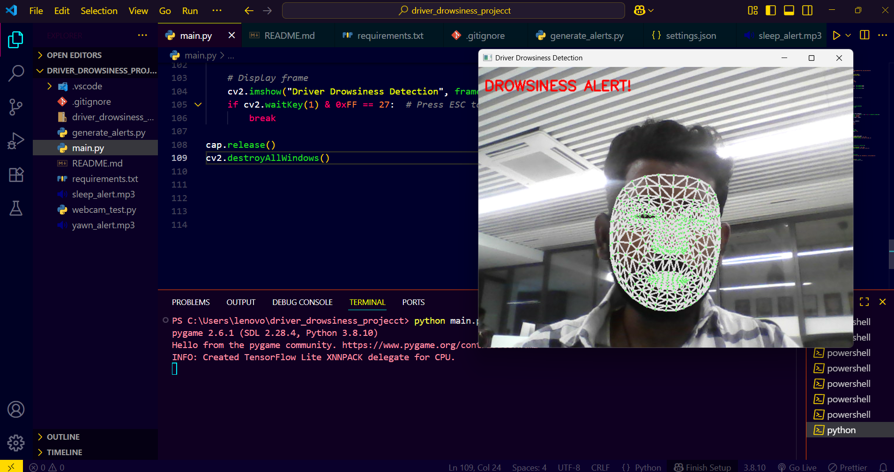
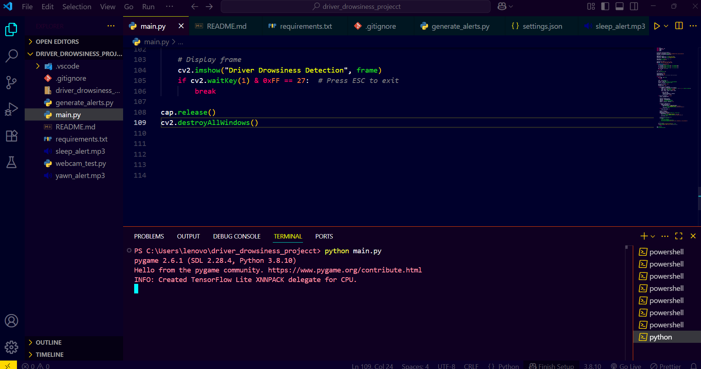
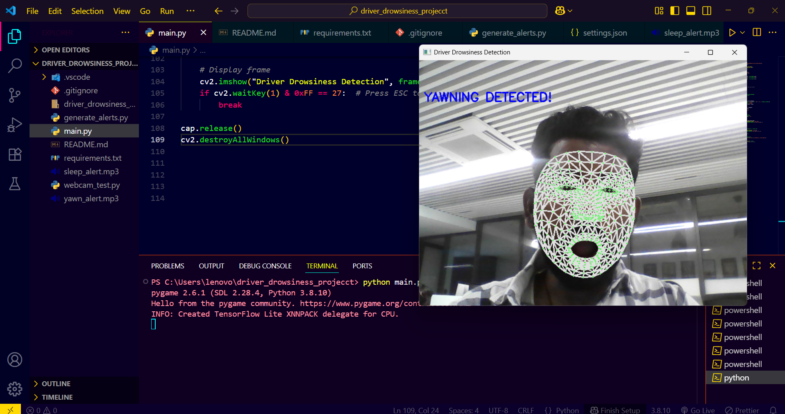

# 🛑 Driver Drowsiness Detection System (Real-Time)

**Tech Stack:** Python, OpenCV, MediaPipe, Pygame  
**License:** MIT  
**Status:** ✅ Completed

This project is a **real-time driver drowsiness detection system** that monitors up to 5 faces using MediaPipe, OpenCV, and Pygame. It detects **eye closure and yawning**, and plays **alert sounds** to help prevent road accidents caused by fatigue.

---

## 🎯 Features

- ✅ Real-time detection of drowsiness and yawning  
- ✅ Multi-face support (up to 5 people)  
- ✅ Alert sounds for yawning and sleep  
- ✅ Accurate detection using MediaPipe Face Mesh  
- ✅ Optimized for real-time webcam use

---

## 🧠 How It Works

- **MediaPipe Face Mesh** detects 468 facial landmarks
- **EAR (Eye Aspect Ratio)** is calculated to detect drowsiness
- **Lip distance** is calculated to detect yawning
- **Alerts are triggered** if:
  - `EAR < threshold` → 🔔 **Sleep Alert**
  - `Lip Distance > threshold` → 🔔 **Yawn Alert**

---

## 📸 Sample Output

  
  

---

## 🗂️ Project Structure

